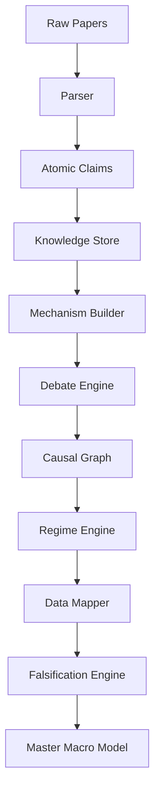
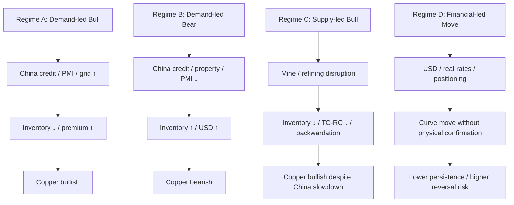
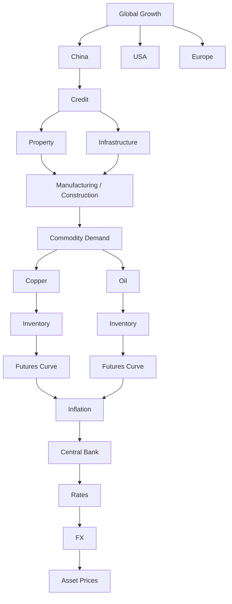

> ⚠ **원문 미대조 · AI 생성 문서.** 이 라이브러리(399편)를 생성한 방법론 문서다. 볼트의 [[매크로 해석 프레임]]과 **경쟁 관계**이므로,
> 두 절차가 충돌할 때는 **볼트 프레임이 우선**한다 — 이쪽은 원문 대조 절차가 없다.

# Macro-Causal Knowledge Graph Synthesizer Manual

> **Mission:** 논문을 요약하지 말고, 문헌을 근거로 하되 반증 가능하고 불확실성을 보존하는 인과 지식 시스템을 구축한다. 모든 논문은 **진실이 아니라 증거**로 취급한다.

## Operating Principle

> Your task is **not** to summarize papers. Your task is to construct a falsifiable, evidence-weighted causal knowledge system from the literature. Treat every paper as evidence, not truth. Extract atomic claims, identify mechanisms, compare contradictory findings, determine boundary conditions, map each mechanism to observable data, connect mechanisms into causal graphs, test them against historical events, and explicitly identify what evidence would falsify each conclusion. Never convert correlation into causation. Never hide disagreement in the literature. Preserve uncertainty.

## 1. Research Pipeline



| 단계 | 산출물 | 금지 사항 |
|---|---|---|
| Parser | 서지·질문·모형·표본·결론 | 저자별 장문 요약 |
| Atomic Claims | 하나의 경제관계만 담은 claim | 여러 인과관계를 하나의 claim에 혼합 |
| Mechanism Builder | 논문이 아닌 메커니즘 노드 | 유사 논문의 단순 병합 |
| Debate Engine | 지지·반대·식별차이·경계조건 | consensus를 자동 진실로 처리 |
| Causal Graph | 방향·조건·confidence가 있는 edge | correlation을 causation으로 전환 |
| Data Mapper | 관찰변수·데이터·시장신호 | narrative를 Tier 1 데이터보다 우선 |
| Falsification Engine | 무효화 조건·대체설명 | 논문 결론을 투자규칙으로 직결 |

## 2. Seven-Layer Paper Schema

| Layer | 질문 | 필수 필드 |
|---|---|---|
| L1 — Question | 무엇을 설명하려 하는가? | Research question, market, horizon |
| L2 — Mechanism | 어떤 경제적 경로인가? | shock → intermediate states → outcome |
| L3 — Identification | 상관·인과를 어떻게 구분하는가? | method, assumptions, instruments, controls |
| L4 — Evidence | 어떤 자료가 어떤 결과를 보였는가? | sample, effect, robustness, historical episode |
| L5 — Boundary Conditions | 언제 작동·약화되는가? | regime, inventory, policy, geography, market structure |
| L6 — Contradictions | 무엇이 반대되거나 다른가? | counter papers, data differences, identification differences |
| L7 — Market Implications | 현실에서 무엇을 관찰해야 하는가? | variables, data, signal, invalidation |

## 3. Atomic Claim Protocol

각 논문에서 **3~10개** atomic claim을 추출한다. 한 claim에는 경제적 관계 하나만 쓴다.

```markdown
## CLAIM-YYYY-NNN

- **Statement:** China credit impulse ↑ → fixed investment ↑, conditional on credit being allocated to investment-intensive sectors.
- **Tags:** [CHINA] [CREDIT] [DEMAND] [GROWTH] [EMPIRICAL]
- **Mechanism:** [[China Credit → Fixed Investment]]
- **Evidence:** [[Paper 406]], [[Paper 428]]
- **Confidence:** HIGH
- **Boundary conditions:** property policy, local-government finance, debt servicing, credit allocation.
- **Observable variables:** TSF, credit impulse, FAI, property starts, grid investment.
- **Falsification:** credit ↑ while investment indicators, copper imports, and industrial demand do not improve.
```

### Required Tags

`[SUPPLY] [DEMAND] [INVENTORY] [FINANCE] [MONETARY] [FISCAL] [TRADE] [GEOPOLITICS] [TECHNOLOGY] [EXPECTATIONS] [COMMODITY] [CHINA] [ENERGY] [FX] [INFLATION] [GROWTH] [EMPIRICAL] [THEORETICAL] [STRUCTURAL] [REDUCED-FORM] [HISTORICAL]`

## 4. Mechanism-First Knowledge Store

논문이 아니라 메커니즘을 중심으로 저장한다.

| Mechanism node | Supporting papers | Contradicting / limiting papers | Observable variables |
|---|---|---|---|
| [[Oil Demand Shock]] | Kilian; Hamilton; Baumeister | single-price shock models | global activity, oil production, real oil price, inventories |
| [[China Credit → Copper Demand]] | Kiyotaki–Moore; BGG; Chen; Dong; Ma | supply-led or FX-led copper regimes | credit impulse, FAI, property, grid, imports, scrap |
| [[Inventory → Futures Curve]] | Working; Fama–French; Deaton–Laroque; Casassus–Collin-Dufresne | financial-only curve explanations | LME/SHFE stocks, cash-3m spread, storage, convenience yield |
| [[Critical Minerals Chokepoint]] | Farrell–Newman; IEA; Wübbeke; Mancheri | diversified supply / substitution evidence | refining concentration, project pipeline, export controls |

## 5. Debate Files

문헌 불일치를 숨기지 않고 독립 파일로 관리한다.

```markdown
# DEBATE_001 — Does financialization increase commodity prices?

## Side A
- Tang & Xiong
- Basak & Pavlova

## Side B
- Knittel & Pindyck
- other skeptical empirical evidence

## Diagnosis checklist
- [ ] Data / sample period
- [ ] Commodity market
- [ ] Identification strategy
- [ ] Financialization definition
- [ ] Model assumptions
- [ ] Storage / inventory controls

## Conditional conclusion
금융화의 효과는 시장·시기·재고상태·식별전략에 따라 다르며, 단일 일반화는 금지한다.
```

## 6. Historical Event Nodes

각 이벤트를 `EVENT → SHOCK → MECHANISM → DATA → MARKET`으로 역검증한다.

| Event node | Core shocks | Mechanism nodes | Validation data |
|---|---|---|---|
| [[2008 Oil Shock]] | global demand, precautionary demand, financial stress | oil demand shock, inventory, investor flows | oil production, inventories, futures, world activity |
| [[2014 Oil Crash]] | shale supply, demand slowdown, OPEC policy | supply response, spare capacity | rig count, production, OPEC policy, Brent curve |
| [[2020 COVID]] | demand collapse, logistics shock | storage, negative prices, supply adjustment | mobility, refinery runs, storage utilization |
| [[2022 Russia-Ukraine]] | sanctions, gas disruption, freight/insurance | geopolitical transmission, strategic reserves | pipeline flows, LNG, freight, inventories |
| [[2023 China Reopening]] | China demand recovery | credit, manufacturing, copper demand | PMI, imports, SHFE inventory, Yangshan premium |
| [[2025 Critical Minerals]] | energy transition, refining concentration | critical-minerals chokepoint | project pipeline, refining shares, recycling |

## 7. Data Hierarchy

| Tier | Data | Role | Trust rule |
|---|---|---|---|
| Tier 1 — Physical | inventory, production, imports, exports, shipments, capacity, utilization, TC/RC | market balance | highest priority |
| Tier 2 — Market | spot, futures, term structure, basis, spreads, volatility, positioning | price discovery | confirm Tier 1 |
| Tier 3 — Macro | GDP, PMI, CPI, PPI, credit, rates, FX | demand / financial context | explain regime |
| Tier 4 — Narrative | news, commentary, policy statements, social media | hypothesis generation | never sufficient alone |

## 8. Falsification Engine

모든 핵심 thesis에 “무엇이 나를 틀렸다고 증명할 것인가?”를 붙인다.

| Thesis | Supporting conditions | Invalidation / failure case |
|---|---|---|
| China stimulus → copper bullish | credit↑, FAI↑, imports↑, inventory↓, premium↑ | credit↑ **but** inventory↑, physical premium↓, TC/RC↑ |
| Mine disruption → copper bullish | output↓, TC/RC↓, refined availability↓, stocks↓ | disruption **but** stocks↑, supply substitution↑, curve unchanged |
| USD↑ → copper bearish | real rates↑, financial demand↓, physical demand weak | USD↑ **but** severe supply shortage·stocks↓·backwardation↑ |
| Energy transition → metal bullish | demand↑ faster than mine/refining capacity | substitution↑, recycling↑, projects on-time, inventory↑ |

## 9. Regime Engine



## 10. Edge Confidence

| Confidence | Meaning | Example |
|---|---|---|
| VERY HIGH | direct physical / accounting relationship | construction activity → copper end-use demand |
| HIGH | repeated theory and evidence with measurable intermediate state | copper demand → inventory balance |
| MEDIUM | robust direction but important competing shocks | inventory → copper spot price |
| LOW | limited data, unstable regime, weak identification | copper price → broad global CPI |
| UNKNOWN | no credible identification or contradictory literature | social-media narrative → persistent price trend |

## 11. Final Five Master Files

| File | Content |
|---|---|
| `MASTER_01_MACRO_SYSTEM.md` | Growth, Inflation, Credit, Monetary Policy, Fiscal Policy, FX, Trade |
| `MASTER_02_COMMODITY_SYSTEM.md` | Supply, Demand, Inventory, Storage, Futures, Convenience Yield, Financialization |
| `MASTER_03_GEOPOLITICAL_SYSTEM.md` | Sanctions, Wars, Chokepoints, Trade Wars, Strategic Reserves, Weaponized Interdependence |
| `MASTER_04_CHINA_SYSTEM.md` | Credit, Property, Infrastructure, Manufacturing, Exports, Imports, Industrial Policy, Commodity Demand |
| `MASTER_05_TRADING_SYSTEM.md` | Regime, Catalyst, Signal, Position, Risk, Invalidation |

## 12. Folder Layout

```text
/Papers
/Claims
/Mechanisms
/Debates
/Events
/Data
/Regimes
/Master
```

## 13. Macro Causal Map v1.0



**Instruction:** 모든 edge에 최소 하나의 supporting paper, 하나의 confidence rating, 관찰 변수, 반증 조건을 붙인다. 문헌 합의가 약하거나 데이터가 불충분하면 `UNKNOWN`을 유지한다.
